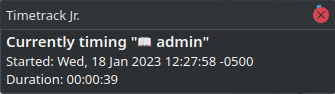

# Timetrack Jr.

Small CLI utility to facilitate tracking the time it takes to do different activities (at work, for consultants, or whatever!).

Timetrack Jr. logs the start and end times of different activities to a local sqlite database and can export summaries of those time logs as csv, json, a text summary, or an .ical file (that you could pull into your favorite calendar tool).

<!-- vscode-markdown-toc -->
* 1. [Features](#Features)
* 2. [Usage](#Usage)
	* 2.1. [Using CLI & help](#UsingCLIhelp)
	* 2.2. [Setting Up Your Timetrack Jr. Database](#SettingUpYourTimetrackJr.Database)
	* 2.3. [Record Some Times!](#RecordSomeTimes)
	* 2.4. [Generate Handy Exports of Logged Times](#GenerateHandyExportsofLoggedTimes)
	* 2.5. [Show what's being timed right now](#Showwhatsbeingtimedrightnow)
	* 2.6. [Editing and Amending Logged Times](#EditingandAmendingLoggedTimes)
* 3. [Building](#Building)
* 4. [Installing](#Installing)

<!-- vscode-markdown-toc-config
	numbering=true
	autoSave=true
	/vscode-markdown-toc-config -->
<!-- /vscode-markdown-toc -->

##  1. <a name='Features'></a>Features
1. Record start end end times for different categories of activity
2. Produce possibly-useful exports of logged times
3. Produce a simple summary of logged activity
4. Auto-complete times at end-of-business if you're a strict-work-life-balance folk like me
5. Cute name
6. Rust?

##  2. <a name='Usage'></a>Usage


###  2.1. <a name='UsingCLIhelp'></a>Using CLI & help
```sh
#####
# CLI
#####
#The cli is structured as a bunch of subcommands.  Use --help to get detailed help for any subcommand (i.e. `ttjr show-config --help`)
$ ttjr --help
Usage: ttjr [OPTIONS] <COMMAND>

Commands:
  show-config      Set up DB and configure options Show config options and currently-registered-categories
  add-category     Create a new category that you can use for time tracking
  delete-category  Delete a category
  set-option       Set a global option
  unset-option     Remove an option
  start-timing     Start timing an activity - stops timing any currently running activities
  stop-timing      End timing
  amend-time       
  delete-time      
  export           Export the DB to a more friendly format for analysis
  help             Print this message or the help of the given subcommand(s)

Options:
      --db-path <DB_PATH>  [default: ttjr.sqlite3]
  -h, --help               Print help information
  -V, --version            Print version information
```

###  2.2. <a name='SettingUpYourTimetrackJr.Database'></a>Setting Up Your Timetrack Jr. Database

```sh
#########
# DB Setup
#########
#time is tracked under different categories
$ ttjr add-category project-for-client-a
$ ttjr add-category project-for-client-b
#if you want, you can set an end-of-day time which will automatically end any started time categories at 17:00
#turns out this is the only available option right now :)
$ ttjr set-option end-of-day 17:00
$ ttjr show-config
{
  "options": {
    "dbversion": "0.1.0",
    "end-of-day": "17:00"
  },
  "categories": [
    "project-for-client-a",
    "project-for-client-b"
  ]
}
#by default, times will be saved to an sqlite db in the current directory
$ ls
ttjr.sqlite3
#If you want it somewhere else, use --db-path like
$ ttjr --db-path ~/.ttjr.sqlite3 <COMMAND>
```

###  2.3. <a name='RecordSomeTimes'></a>Record Some Times!

```sh
######
# Start timing stuff!
######
#start working on something, add --notify to fire a desktop notification, useful if you bind `start-timing` commands to global keyboard shortcuts
$ ttjr start-timing project-for-client-a --notify
#hopefully do some work for a while...
#start working on something else (no need to explicitly stop timing)
$ ttjr start-timing project-for-client-b
#go get a sandwich
$ ttjr stop-timing 
#back to work little capitalist
$ ttjr start-timing project-for-client-a
```

If you use the `-n/--notify` option you'll get little toast messages like this:  
  


###  2.4. <a name='GenerateHandyExportsofLoggedTimes'></a>Generate Handy Exports of Logged Times

```sh
######
# Export timing data to do something interesting with it!
######
#quick summary - use exact dates or human-readable date-like strings to constrain exports
$ ttjr export --format summary --start-time "14 days ago"
Tabulating results starting on/after Fri, 28 Oct 2022 19:18:02 -0400
Logged 3 activites for a total of 03:00
project-for-client-a:
  2 logs, 01:00 cumulative, 33.33% of total
project-for-client-b:
  1 logs, 02:00 cumulative, 66.67% of total

#Export time data as json, csv, or ical
$ ttjr export --format json
[
  {
    "id": 1,
    "category": "project-for-client-a",
    "start_time": 1667307600,
    "end_time": 1667311200
  },
  {
    "id": 2,
    "category": "project-for-client-b",
    "start_time": 1667311200,
    "end_time": 1667318400
  },
  {
    "id": 3,
    "category": "project-for-client-a",
    "start_time": 1667322000,
    "end_time": null
  }
]

#Have ttjr generate and keep up-to-date an ical file that you can pull into gcal/outlook/etc
#HOT TIP: export to an ical file in dropbox/gdrive/etc and publish it so you can point a web calendar at it!
$ ttjr export --format ical --outfile ~/my_times.ical --listen
```

###  2.5. <a name='Showwhatsbeingtimedrightnow'></a>Show what's being timed right now
```sh
#Show the time log that's currently being recorded (i.e. what's been started but hasn't been stopped yet)
#Optionally send a desktop notification with --notify
$ ttjr currently-timing --notify
{
  "id": 7,
  "category": "📖 admin",
  "start_time": 1668452495,
  "end_time": null
}
```

If you use the `-n/--notify` option you'll get a little tost like this:  



###  2.6. <a name='EditingandAmendingLoggedTimes'></a>Editing and Amending Logged Times

```sh
######
# Editing/amending times
######
#amend an entry in case you started or stopped it at the wrong time (or made it the wrong category)
$ ttjr amend-time 2 -s "2022-11-01 10:00" -e "2022-11-01 12:00"
#delete an entry
$ ttjr delete-time 3
```

##  3. <a name='Building'></a>Building
```sh
$ cargo build --release
```

##  4. <a name='Installing'></a>Installing
1. Download a binary from the "Releases" page (linux/windows x86_64), OR:
2. Use `cargo` to install:
    ```sh
    $ cargo install -f timetrack_jr
    $ ttjr --help
    ```